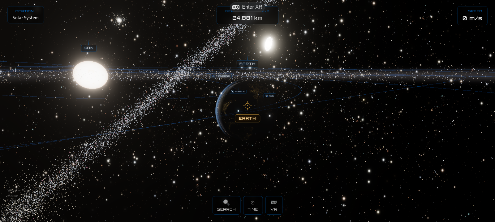
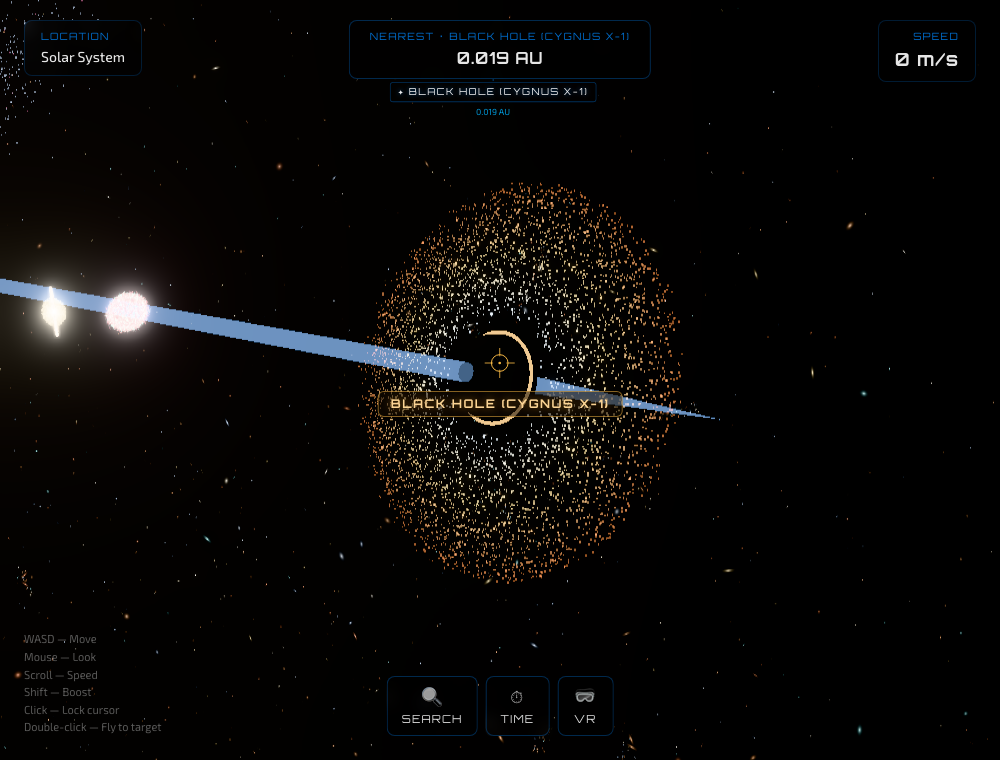
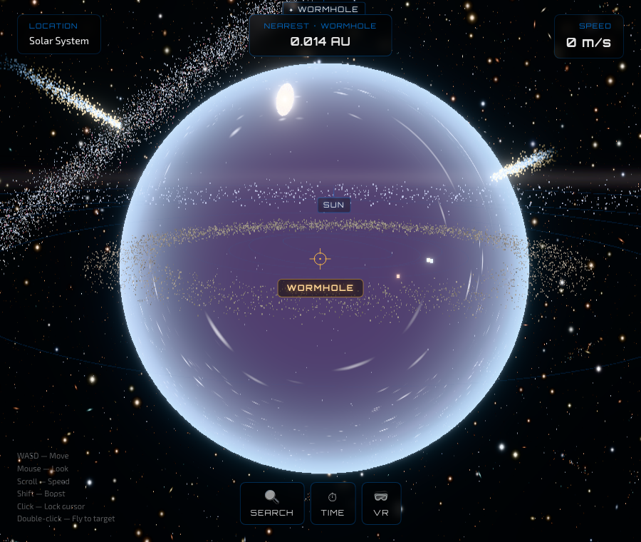
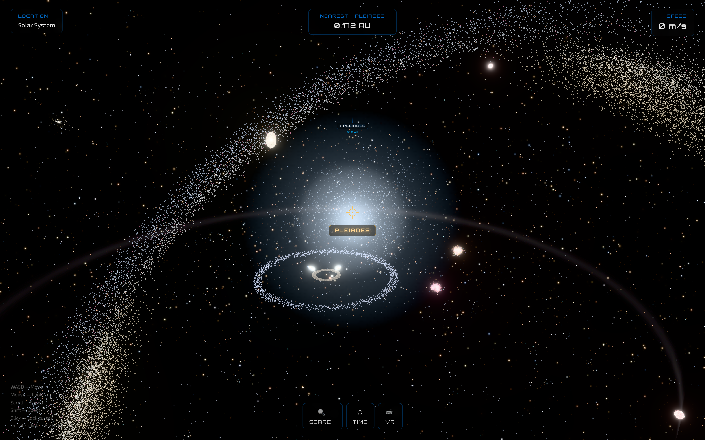
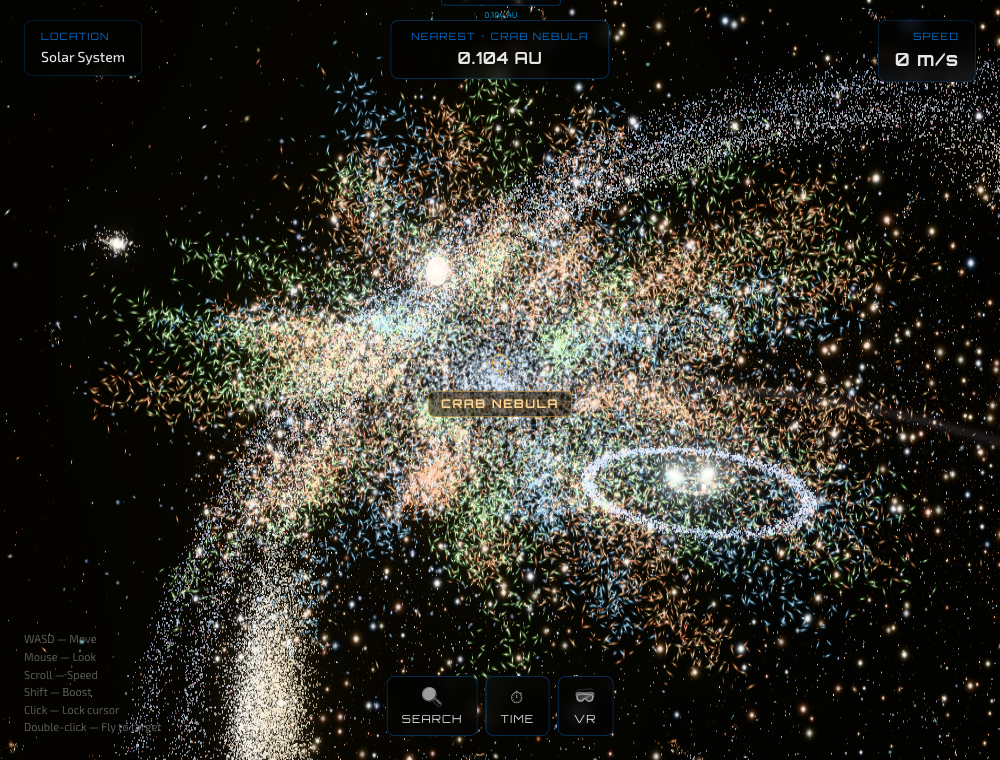
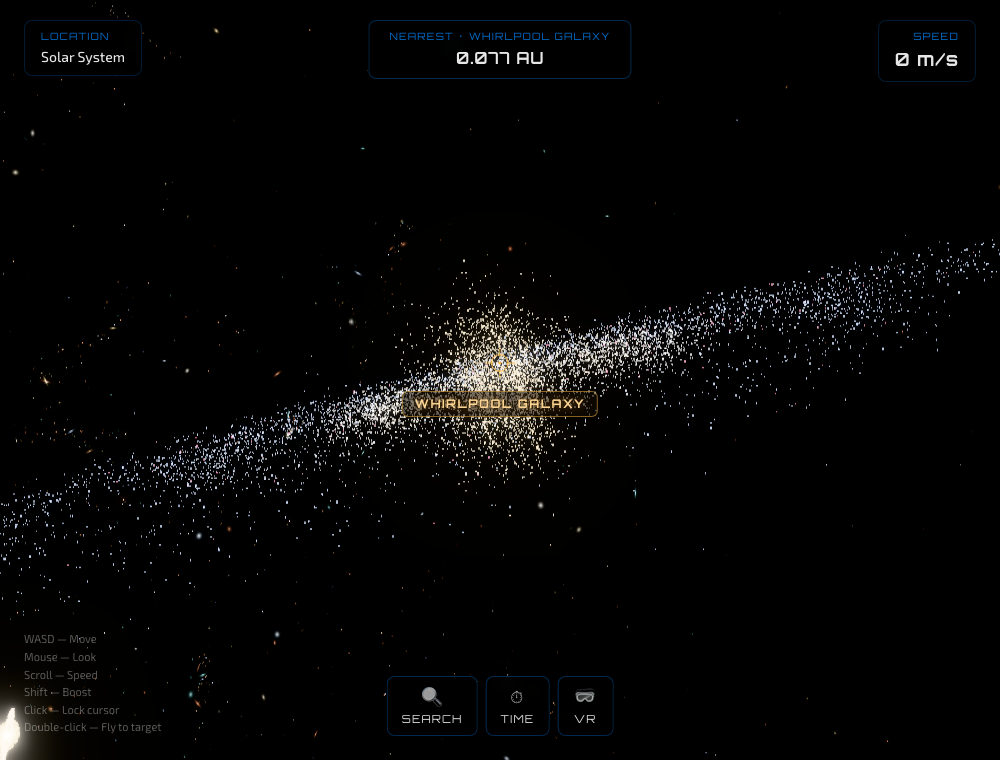
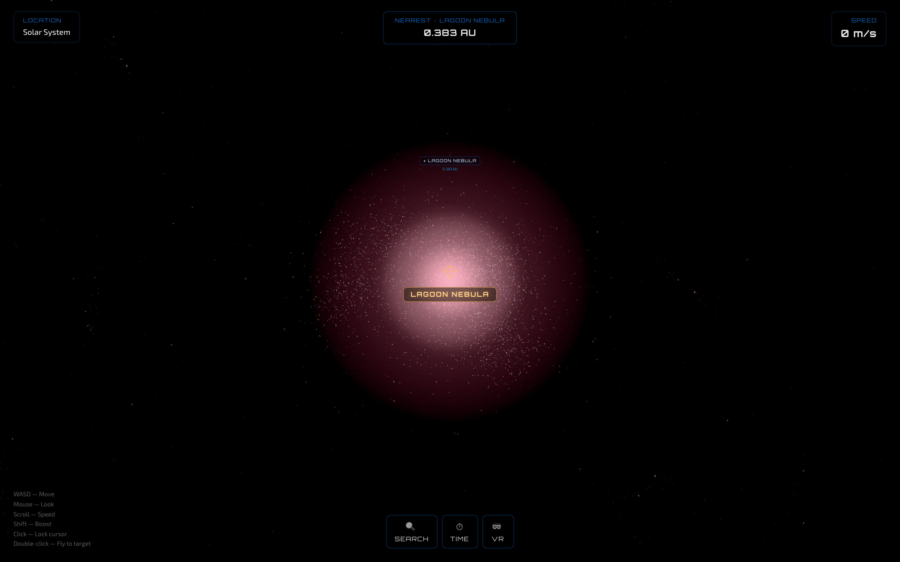
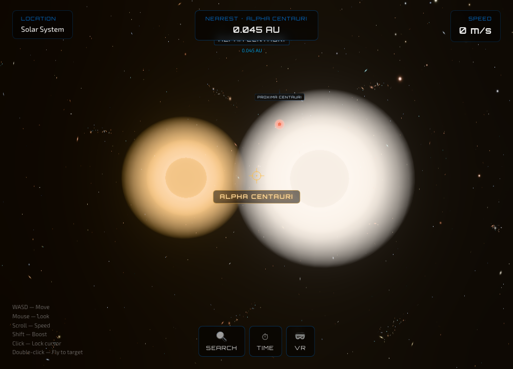
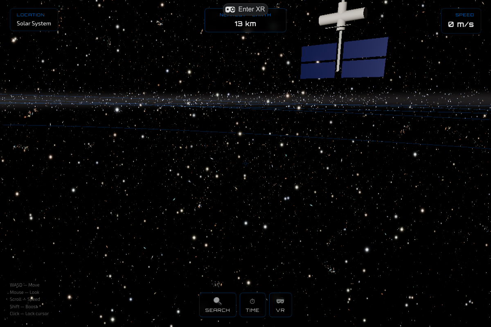

<div align="center">

# 🪐 SpaceSim

### A love letter to the night sky — fly the real, scientifically faithful universe, from your backyard to the edge of everything. In a browser tab.



[**▶ Launch the live demo**](https://nnistala.github.io/spacesim/) · [Features](#-features) · [Gallery](#-gallery) · [Getting started](#-getting-started) · [What's next](#-where-its-wandering-next)

</div>

---

## ✨ Why this exists

I've always found the night sky almost unbearably beautiful — the quiet enormity of it, the thought that the light landing in your eye left some of those stars before there were any eyes to catch it. SpaceSim is my attempt to bottle a little of that feeling: a **real, explorable universe** you can fall into from a browser tab, drift from the surface of Earth all the way out to the faint cosmic web, and just… *look*.

The one rule I set myself: it has to be **true**. Not a pretty backdrop — the actual universe, with every star, planet, moon and nebula where it really is, the size and colour it really is. So space is black, the Sun is white-hot (never the cartoon yellow), light fades with the inverse square of distance, shadows are genuinely dark, and the planets ride real Keplerian ellipses to wherever they happen to sit in the sky *tonight*. Get the physics honest and the beauty takes care of itself.

It should feel serene most of the time — and, when you drift up to a dying star or the rim of a black hole, just a little bit terrifying. The way the real thing would be, if you were ever lucky and unlucky enough to be there.

This is a side project, made for the love of it. There's no destination — just the wandering.

## 🌌 What it is

A free-flight space simulator spanning **six scales** — surface → orbital → planetary → stellar → galactic → cosmic — stitched together with a hybrid logarithmic scale so the entire universe fits inside one continuous, float-safe scene. No loading screens between worlds; you just keep flying. Point yourself at anything, search for it by name, and let the targeting scope whisper back what you're looking at.

## 🚀 Features

- **The Solar System, to scale** — the Sun (white G2V blackbody with constantly erupting flares & prominences), all eight planets at true relative size on real elliptical orbits, Saturn's rings, and procedural NASA-derived textures.
- **18 natural satellites** — the Galilean moons of Jupiter, Titan and friends at Saturn, the moons of Mars, Uranus and Neptune (including retrograde Triton), each correctly sun-lit with real orbital-period ratios.
- **Human-made objects** — fly up to **real public-domain NASA 3D models** of the ISS, Hubble, the Mars rovers (Perseverance, Curiosity), LRO, MRO, MAVEN and GOES, plus Tiangong, GPS and the Apollo flags.
- **Minor bodies** — the asteroid belt, comets with ion + dust tails, and shooting-star meteors streaking across the sky.
- **Deep sky** — our nearest neighbour **Alpha Centauri** (a real triple-star system), a **black hole** (Cygnus X-1) with a glowing, gravitationally-lensed accretion disk, a **wormhole** out near Saturn, the **Milky Way**, the **Andromeda**, **Triangulum**, **Whirlpool** and edge-on **Sombrero** galaxies, the **Crab Nebula** supernova remnant, the **Carina**, **Orion**, **Eagle/Pillars** and **Lagoon** nebulae, the **Ring** and **Helix** planetary nebulae, the blue **Pleiades** cluster, the **Local Group**, the **Virgo Cluster**, and the cosmic web all the way out to the observable edge.
- **Targeting scope** — a reticle that locks onto and names whatever body is in your sights.
- **Search & fly-to** — press `/`, type any object's name, and warp straight to a perfectly framed view.
- **Time controls** — pause or speed up the simulation to watch moons and satellites orbit.
- **WebXR / VR (experimental)** — on a Quest or other WebXR headset, a **VR** button appears; step inside and fly the universe in your hands. Left stick flies you where you're looking, right stick snap-turns, grip/trigger boosts. *(The flat-screen HUD and search don't render in-headset yet — see the roadmap.)*

## 🖼 Gallery

| | |
|---|---|
|  **Black Hole (Gargantua / Cygnus X-1)** — a lensed, glowing accretion disk and photon ring |  **Wormhole** — a refracting sphere of warped starlight, out near Saturn |
|  **Pleiades (M45)** — the Seven Sisters, a young blue open cluster |  **Crab Nebula (M1)** — supernova remnant in the Hubble palette |
|  **Whirlpool Galaxy (M51)** — a grand-design spiral |  **Lagoon Nebula (M8)** — a pink H‑α star-forming cloud |
|  **Alpha Centauri** — our nearest stellar neighbours (with red Proxima) |  **ISS** — the real NASA 3D model, up close |

> 🥚 **There's a secret hidden out near Saturn.** I won't say what it does or how it works — but wander close enough, and you might suddenly find yourself somewhere you have absolutely no business being. Fans of a certain space film will know it when they feel it.

## 🔬 Scientific accuracy

Wonder and rigour aren't opposites here — the awe *comes from* the fact that it's all real. So SpaceSim leans on honest physics and real data, every time:

- The **Sun is white** (G2V, ~5778 K blackbody), not yellow.
- **Distances** use real astronomical values; only the empty gaps are log-compressed so travel stays tractable.
- **Orbits** are elliptical (Keplerian), solved with a real Kepler-equation solver, at each body's true position for today's date.
- **Lighting** is a single source per star system following the inverse-square law; shadows are truly black (no fake ambient).
- **Star and nebula colors** come from spectral type / emission-line physics (e.g. the Crab's orange hydrogen, green sulfur, blue oxygen, blue-white synchrotron core).
- Positions of deep-sky objects use their **real sky coordinates** (RA/Dec).

## 🎮 Controls

| Input | Action |
|---|---|
| `W` `A` `S` `D` | Move (forward / strafe) |
| Mouse | Look (click canvas to lock pointer) |
| Hold `W` | Charge warp speed |
| `Shift` | Boost · `Space` Brake |
| Scroll | Adjust speed |
| `/` | Search the universe → fly to any object |
| Targeting scope | Auto-names the body in your sights |

**In VR** (Quest / WebXR headset): **left stick** — fly where you look · **right stick** — snap-turn · **grip / trigger** — boost. Speed scales with how close you are, so the same nudge crawls you up to the ISS or warps you between galaxies.

## 🧰 Tech stack

- **React 19** + **TypeScript** (strict)
- **Three.js** via **React Three Fiber** + **drei** + **postprocessing**
- **WebXR** via `@react-three/xr`
- **Zustand** state · **Vite** build · **Tailwind CSS** (HUD overlays)
- Custom **GLSL** shaders for the Sun, atmospheres, star fields and galaxies
- Public-domain **NASA** imagery and astronomical data

## 🏁 Getting started

```bash
git clone https://github.com/nnistala/spacesim.git
cd spacesim
npm install
npm run dev        # http://localhost:5173
```

Other scripts:

```bash
npm run build      # production build (type-checks + bundles)
npm run preview    # preview the production build
npm run lint       # ESLint
```

## ☁️ Deployment

The live site is hosted on **GitHub Pages** at **https://nnistala.github.io/spacesim/** (served from the `gh-pages` branch).

A ready-to-use GitHub Actions workflow for automated build-and-deploy on every push is included at `.github/workflows/deploy.yml`. To enable it, grant the `workflow` scope once (`gh auth refresh -h github.com -s workflow`), commit the `.github/` folder, and switch the Pages source to "GitHub Actions".

## 🗺 Where it's wandering next

The list is never really finished — there's always one more beautiful thing out there to chase:

- The **Horsehead**, sharper **Pillars of Creation**, and properly structured planetary-nebula shells
- **Pulsars** and **magnetars** — lighthouses at the end of stellar life
- Actually **landing** on a planet — surface terrain under your feet
- The **Laniakea Supercluster**'s great gravitational river of galaxies
- Progressive **2K → 8K** texture streaming as you draw close
- The Sun's twisting **magnetic field** made visible
- **In-headset UI** — bring the labels, search and targeting scope into the 3D scene so VR is fully self-contained (and a WebXR-aware bloom pass)

## 🙏 Credits & data

Imagery and astronomical data courtesy of **NASA / ESA / Hubble / JWST / SDO** (public domain). Built with the open-source React Three Fiber ecosystem.

---

<div align="center">
<sub>Made with a telescope-sized dose of wonder. Pull requests and star-gazers welcome. ⭐</sub>
</div>
